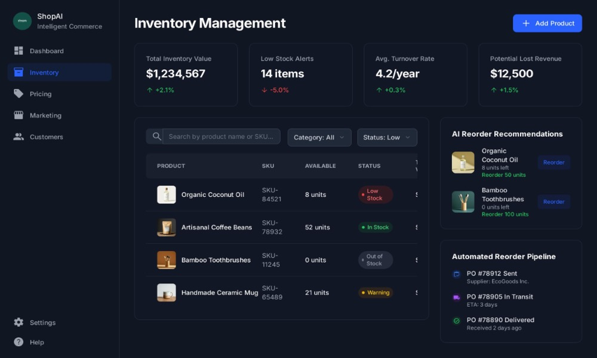

# 🌿 StockSmart: Retail Inventory Optimization System

[](https://github.com/ShreyaSharma0412/StockSmart/actions/workflows/ci.yml)


**StockSmart** is a fullstack retail inventory management application built with **Spring Boot 3** and **Angular 19**. It features real-time stock tracking, an AI reorder pipeline, interactive movement analytics, barcode/RFID hardware simulation, and automated reporting — all served under a single unified local URL.

---

## 📸 Application Screenshots

### 📊 1. Executive Dashboard & Interactive Movement Graph
*Real-time turnover trends, KPI metric summaries, category stock rings, and interactive Sales vs Restocks charts.*


---


---

### 📈 2. AI Assistant & Automated Reorder Pipeline
*Automated purchase order tracking, supplier integrations, and AI safety stock recommendations.*



---

## ✨ Key Features

- **🛍️ Retail Product Catalog**: Pre-populated with real market items (Apple AirPods Pro, Sony WH-1000XM5, Samsung T7 SSD, Stanley Tumblers, Le Creuset Dutch Ovens, Nespresso Pods, etc.).
- **🏷️ Barcode & RFID Identifier Tracking**: 13-digit EAN barcodes and UHF passive RFID tags for every asset.
- **⚡ Interactive Sales vs Restocks Graph**: Dynamic SVG line chart with real-time time-period filtering (This Year, Last Quarter, This Month) and interactive tooltips.
- **🔍 Multi-Field Search Engine**: Instant filtering across product names, SKUs, barcodes, RFID tags, categories, suppliers, locations, and descriptions.
- **🤖 AI Reorder Recommendation Engine**: Automated PO generation and supplier reorder pipeline tracking.
- **📄 CSV Export Suite**: Download full product catalogs and low-stock alert logs with one click.
- **🔐 Demo Authentication & Role Guard**: Protected routes with form validations (`admin@stocksmart.com` / `admin123`).
- **⚙️ Single Unified Server**: Spring Boot serves both REST APIs and Angular SPA static assets at `http://localhost:8080/`.

---

## 🛠️ Technology Stack

| Layer | Technology |
| :--- | :--- |
| **Backend Framework** | Java 17, Spring Boot 3.4.1 |
| **Persistence & Database** | Spring Data JPA, H2 In-Memory Database (`jdbc:h2:mem:stocksmartdb`) |
| **Frontend Framework** | Angular 19.1.0, RxJS, TypeScript |
| **Styling & Aesthetics** | Modern Light Emerald Design, Glassmorphism, Vanilla CSS |
| **CI/CD Pipeline** | GitHub Actions (`.github/workflows/ci.yml`) |

---

## 🚀 Getting Started

### Prerequisites
- **JDK 17** or higher
- **Node.js 20** or higher
- **Maven 3.8+** (or use included `./mvnw`)

### 1. Clone the Repository
```bash
git clone https://github.com/ShreyaSharma0412/StockSmart.git
cd StockSmart
```

### 2. Build Frontend Bundle (Optional - Pre-compiled in static resources)
```bash
cd frontend
npm install
npm run build
cd ..
```

### 3. Run the Spring Boot Application
```bash
./mvnw spring-boot:run
```

### 4. Open in Browser
Open your browser and navigate to:
👉 **[http://localhost:8080/](http://localhost:8080/)**

#### 🔑 Demo Credentials
- **Email**: `admin@stocksmart.com`
- **Password**: `admin123`

---

## ⚙️ GitHub Actions CI/CD

This repository includes an automated GitHub Actions pipeline (`.github/workflows/ci.yml`) that triggers on every `push` and `pull_request` to `main`:
1. Compiles the Angular SPA frontend.
2. Copies build artifacts to `src/main/resources/static/`.
3. Packages the Spring Boot JAR application using JDK 17.
4. Uploads build artifacts automatically.

---

## 📄 License
Distributed under the MIT License. See `LICENSE` for more information.
